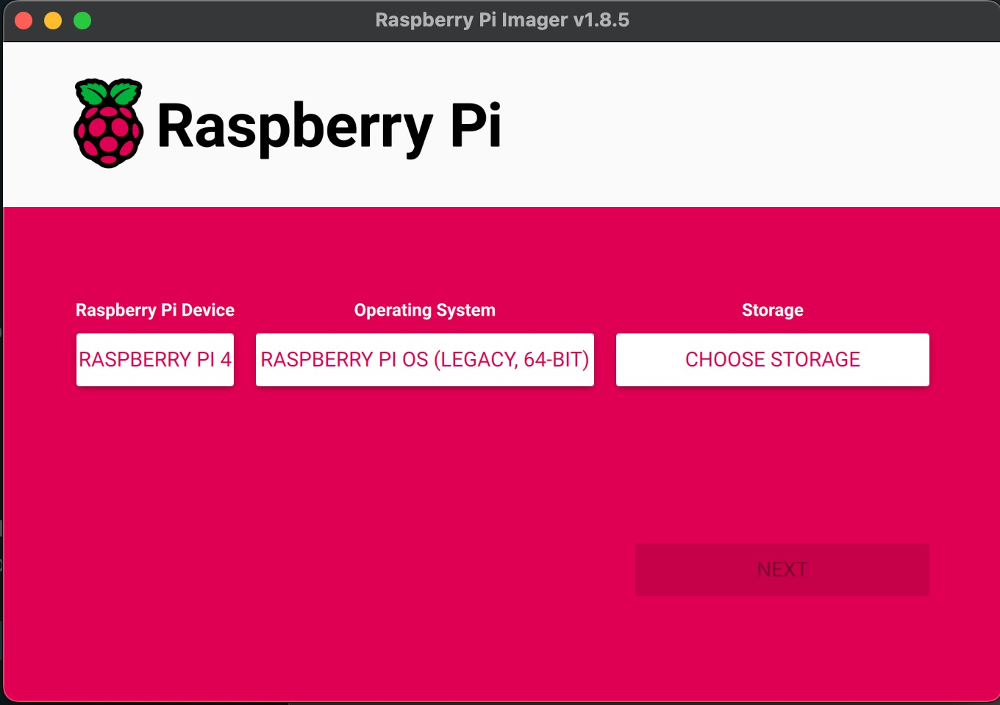

# Setup basic_bot on a Raspberry Pi4 with Raspian Bullseye

...for basic_bot, ovencv and tflite

## Flash and Boot

First you need to flash an image to a microcard reader using the [Raspberry Pi installer](https://www.raspberrypi.com/software/).

Debian Bookworm is the new Raspian Bullseye.  [Good article](https://www.raspberrypi.com/news/bookworm-the-new-version-of-raspberry-pi-os/) on the differences. The rest of this guide is specific to Bullseye.

If you are setting up a new Raspberry Pi4 or Pi5, you should probably use the latest OS (Bookworm) unless you have a real need to use Bullseye.  See also our [guide for installing on Pi4 or Pi5 with Debian Bookwork](https://littlebee.github.io/basic_bot/Installation%20Guides/setup_on_pi_bookworm/).


To validate basic bot, I used the [Raspberry Installer](https://www.raspberrypi.com/software/) to flash a micro SSD.  I selected Bullseye from the legacy OSs.

{: style="transform:scale(.8);"}


## SSH into the pi

```sh
ssh pi4.local
```

Verify that Raspian/Debian bullseye was installed:
```sh
bee@pi4:~ $ cat /etc/os-release
PRETTY_NAME="Debian GNU/Linux 11 (bullseye)"
NAME="Debian GNU/Linux"
VERSION_ID="11"
VERSION="11 (bullseye)"
VERSION_CODENAME=bullseye
ID=debian
HOME_URL="https://www.debian.org/"
SUPPORT_URL="https://www.debian.org/support"
BUG_REPORT_URL="https://bugs.debian.org/"```
```

## Update and upgrade OS


```sh
sudo apt update
sudo apt full-upgrade
sudo reboot
```
SSH back into Raspberry Pi after reboot.

Check versions:
```sh
bee@pi4:~ $ python --version
Python 3.9.2
bee@pi4:~ $ python -m pip --version
pip 20.3.4 from /usr/lib/python3/dist-packages/pip (python 3.9)
```

## Install Basic Bot

Follow the [instructions in Getting Started](https://littlebee.github.io/basic_bot/#run-the-software-on-your-robot) for installing and
running basic_bot.


## Use picamera2 instead of opencv if using ribbon cable camera

As of Feb 7, 2025, OpenCV camera capture [will NOT work on Debian Bullseye or Bookworm
with a ribbon cable camera](https://github.com/opencv/opencv/issues/21653).

You must either use a USB camera or use the `basic_bot.commons.camera_picamera`
module.

See the [API docs for using camera_picamera](https://littlebee.github.io/basic_bot/Api%20Docs/commons/camera_picamera/) for more information about how to use.